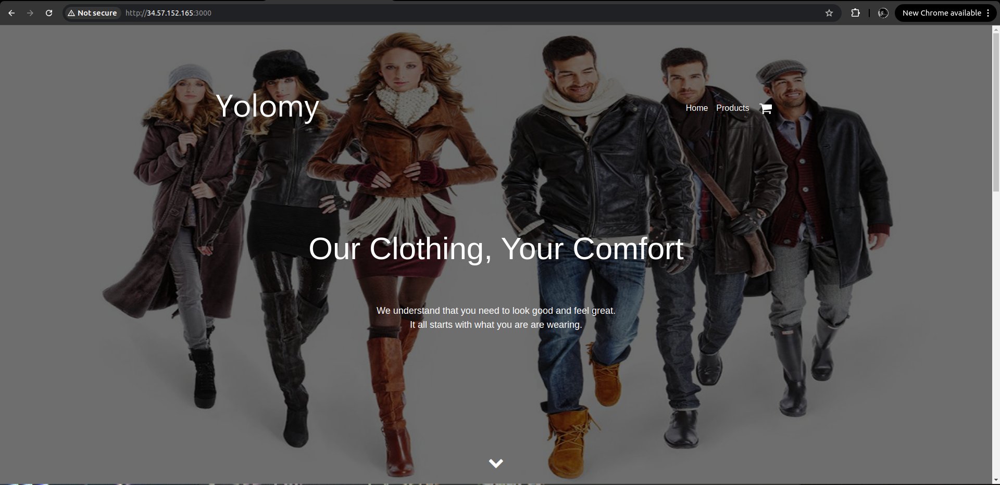

# Overview
This project involved the containerization and deployment of a full-stack yolo application using Docker.

# Project link
http://34.57.152.165:3000

# Requirements
Install the docker engine here:
- [Docker](https://docs.docker.com/engine/install/) 

## How to launch the application 

## How to run the app
Use vagrant up --provison command
